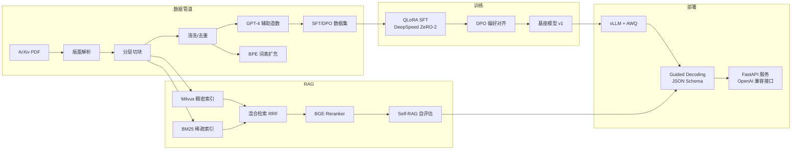

# 混合 RAG + vLLM 学术文档 Agent 系统

> 项目周期：2025.10 – 2026.3 · 简历工程化落地版本

针对长篇幅科研论文与技术文档中格式复杂、通用大模型易产生幻觉、检索召回率低等问题，基于开源基座模型搭建的高精度文献问答 Agent：**原文可溯源、结构化推理、低延迟流式输出**。数据源基于 ArXiv 开源文档，结合 GPT-4 构造微调与偏好对齐数据集。

## 四大技术支柱

| 模块 | 技术方案 | 运行环境 |
| --- | --- | --- |
| a. 领域词表 + SFT | BPE 算法扩充学术领域词表；数据构建与清洗；QLoRA + DeepSpeed ZeRO-2 多轮指令微调 | GPU 服务器（Linux） |
| b. DPO + 结构化约束 | CoT 引用偏好数据集 + DPO 对齐；vLLM Guided Decoding 语法树约束，实现 JSON Schema 强约束解码 | GPU 服务器（Linux） |
| c. 混合 RAG + Self-RAG | 版面解析层次化切块；Milvus + BM25 混合检索；BGE-Reranker 重排序；Self-RAG 自评估抑制幻觉 | 本机（CPU）可跑 |
| d. vLLM 部署加速 | PagedAttention、Continuous Batching、AWQ 4-bit 量化；低延迟流式响应 | GPU 服务器（Linux） |

## 架构总览



## 目录结构

```text
.
├── configs/               # 所有模块的 YAML/JSON 配置
│   ├── data/              # 数据采集配置
│   ├── rag/               # 检索/切块/重排/自评估配置
│   ├── train/             # SFT / DPO / DeepSpeed 配置
│   └── serving/           # vLLM 服务与输出 JSON Schema
├── docs/                  # 各模块设计文档
├── src/
│   ├── data/              # 采集、版面解析、清洗、造数、词表扩充
│   ├── rag/               # 切块、向量存储、BM25、混合检索、重排、Self-RAG
│   ├── train/             # SFT、DPO、分词/掩码工具
│   ├── serving/           # FastAPI、引导解码、客户端
│   └── eval/              # 忠实度、引用评测
├── scripts/               # 可执行入口（数据/检索/训练/部署）
├── work/                  # 中间产物（数据、模型、日志，已 gitignore）
└── outputs/               # 用户可见交付物
```

## 里程碑（建议执行顺序）

1. **M0 环境**：安装依赖、确认本机可跑 RAG 演示
2. **M1 数据管道**（本机）：采集 ArXiv 论文 → 版面解析 → 分层切块 → 清洗 → GPT-4 造数 → BPE 词表扩充
3. **M2 训练**（GPU 服务器）：QLoRA SFT → DPO 对齐 → 合并/量化导出
4. **M3 RAG**（本机）：Milvus + BM25 混合检索 → BGE 重排 → Self-RAG 自评估
5. **M4 部署**（GPU 服务器）：vLLM + AWQ + Guided Decoding + FastAPI 流式服务
6. **M5 评测与演示**：检索召回、忠实度、引用命中、延迟指标 + 端到端演示

## 硬件与环境

- **本机（CPU）**：数据管道、RAG 全流程、评测脚本均可运行，模型默认使用轻量版（bge-small / MiniLM）。
- **GPU 服务器（Linux，建议 ≥24GB 显存）**：SFT、DPO、vLLM 部署。
  - vLLM 不支持原生 Windows，请使用 WSL2、云 GPU（如 AutoDL / 恒源云）或实验室服务器。
  - 显存不足 24GB 时可将基座换成 Qwen2.5-3B-Instruct，配置见 `configs/train/*.yaml`。

## 快速开始（本机）

```bash
# 1. 安装基础 + RAG 依赖（建议使用虚拟环境）
pip install -r requirements/requirements-base.txt
pip install -r requirements/requirements-rag.txt

# 2. 采集几篇样例论文（如指定 arXiv ID）
python scripts/data/fetch_papers.py --ids 1706.03762,2005.11401 --out work/data/arxiv_pdfs

# 3. 构建 RAG 索引（版面解析 → 切块 → Milvus/内存向量库 + BM25）
python scripts/rag/ingest_papers.py --pdf-dir work/data/arxiv_pdfs --config configs/rag/retriever.yaml

# 4. 查询演示
python scripts/rag/query.py --query "Attention mechanism 是如何计算的？" --config configs/rag/retriever.yaml --top-k 5
```

## 快速开始（GPU 服务器）

```bash
# 训练：先扩词表，再 SFT，再 DPO
python scripts/data/expand_vocab.py --corpus-dir work/data/arxiv_txt --base-tokenizer Qwen/Qwen2.5-7B-Instruct --out work/models/extended_tokenizer
python -m src.train.sft --config configs/train/sft_qlora.yaml
python -m src.train.dpo --config configs/train/dpo.yaml

# 量化 + 部署
python scripts/serving/quantize_awq.py --model work/models/sft-merged-qwen7b --out work/models/sft-merged-qwen7b-awq
bash scripts/serving/run_vllm.sh
python scripts/serving/start_api.py --config configs/serving/vllm.yaml
```

## 评测指标

- 检索：Recall@K、MRR、混合检索相对单一检索的增益
- 忠实度：主张级 NLI 支持率（Self-RAG 判定）
- 引用：Citation Recall / Precision（预测引用 vs 标注引用）
- 服务：首 token 延迟、吞吐（tokens/s）、流式响应稳定性

详细设计见 [docs/01-architecture.md](docs/01-architecture.md)。

## 实测指标（2026-08-17，AutoDL RTX 4090，7B 模型）

### 检索（50 个单句查询）

| 方法 | Recall@5 | Recall@10 | MRR@10 |
| --- | --- | --- | --- |
| 稠密（bge-small） | 0.90 | 0.90 | 0.83 |
| 稀疏（BM25） | 0.98 | 1.00 | 0.95 |
| 混合（RRF+重排） | **1.00** | **1.00** | **0.99** |

### RAG 生成（10 个查询）

| 指标 | 数值 |
| --- | --- |
| 忠实度（主张级 NLI 支持率） | 0.90 |
| 引用召回 / 精确率 | 0.60 / 0.55 |
| 引用-检索对齐率 | 0.80 |
| 平均生成延迟 | 13.6 s/query |

评测脚本：`scripts/eval/run_eval.py`；原始数据：`outputs/eval_report.json`。

## 常见问题（本机 Windows 开发）

1. **pip 装 torch 报 WinError 206（路径过长）**：Windows 长路径未开启且项目路径较长所致。
   把虚拟环境建到短路径（如 `%TEMP%\av`）再安装即可：
   `python -m venv %TEMP%\av`，之后用 `%TEMP%\av\Scripts\python.exe` 运行脚本。
   Linux GPU 服务器不存在此问题。
2. **HuggingFace 官方域名不通**：设置镜像后重新运行：
   `$env:HF_ENDPOINT="https://hf-mirror.com"`（Windows）或 `export HF_ENDPOINT=https://hf-mirror.com`（Linux）。
3. **模型下载无权限（WinError 5）**：把缓存放到项目内：
   `$env:HF_HOME="<项目>/work/models/hf_cache"`。
4. **ArXiv 接口 429 限流**：采集脚本已内置退避重试，并在元数据接口失败时自动直连
   `https://arxiv.org/pdf/<id>` 下载 PDF。
5. **训练/部署必须在 Linux GPU 服务器**：vLLM 不支持原生 Windows；可用 WSL2 或云 GPU。
